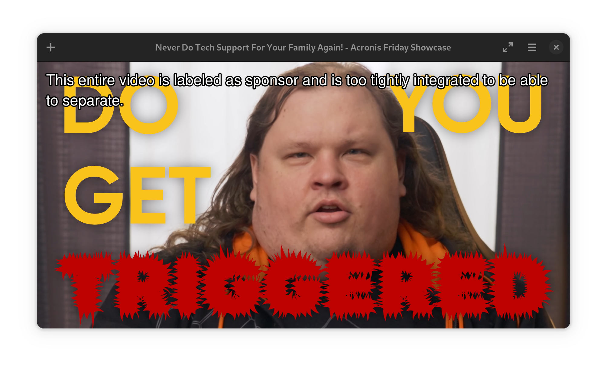

# SponsorBlock plugin for MPV
A port of [SponsorBlock](https://github.com/ajayyy/SponsorBlock) for MPV (or Celluloid) written in Rust.

- Why write a MPV plugin in Rust ?
Why not!

- Can I write my own plugin in Rust ?
Yes! Just follow the example [here](https://crates.io/crates/mpv-client) and you will be ready.

## Rquirements
- rust

## Build
Build the plugin:
```bash
rustup override set nightly
cargo build --release
```

## Installation
Move the lib generated to your MPV (or Celluloid) `scripts` folder.
```bash
cp ./target/release/libmpv_sponsorblock.so ~/.config/mpv/scripts/sponsorblock.so
```

You can choose to install the configuration file too:
```bash
cp ./sponsorblock.toml ~/.config/mpv/sponsorblock.toml
```
If you don't, only the sponsors segments will be skipped by default as specified by the [API](https://wiki.sponsor.ajay.app/w/API_Docs).

## Usage
Play a YouTube video and segments you chose in the configuration file will be skipped or muted. If the video is entirely labeled as a category it will be shown at startup :

